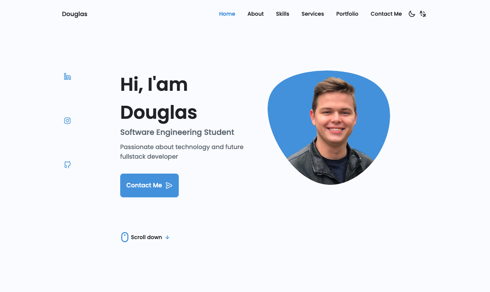
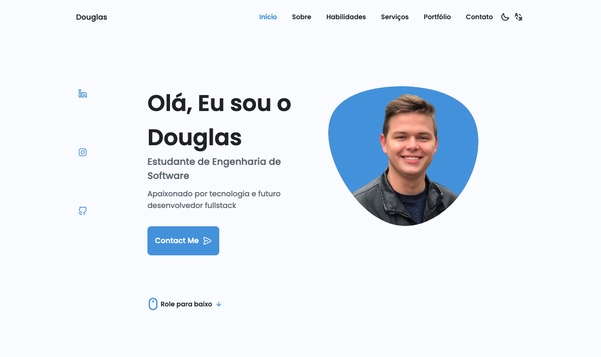

## Website have the english for the first language.

 

## E a possui opção para mudar para português do Brasil.

 

## 🚀 Tecnologias

Esse projeto foi desenvolvido com as seguintes tecnologias:

- HTML;
- CSS;
- JavaScript;

## 💻 Projeto

Projeto com o objetivo da criação de um site para ser utilizado como portfólio pessoal,
nele estarei postando meus trabalhos já realizados, locais que já trabalhei, locais que estudei e estudo, habilidades, etc.

## 🔖 Layout

Você pode visualizar o layout do projeto através [desse link](https://douglastrey.com/).
